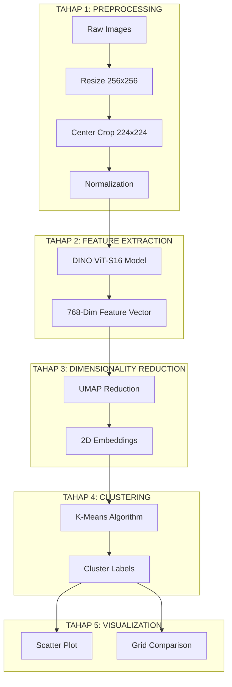

# LAPORAN KOMPREHENSIF: KLASIFIKASI VISUAL OTOMATIS PATUNG BALI
## Berbasis Unsupervised Clustering DINO ViT-S16

---

## 1. PENDAHULUAN
Laporan ini merangkum seluruh implementasi teknis sistem pengelompokan gambar patung tradisional Bali secara otomatis. Sistem ini dibangun untuk mengatasi tantangan pengarsipan manual dengan memanfaatkan teknologi *Self-Supervised Learning* terbaru.

### Objektif Utama:
- Mengekstraksi fitur visual mendalam dari 10.052 gambar patung.
- Mengelompokkan gambar ke dalam cluster yang memiliki kemiripan visual.
- Mengevaluasi kualitas cluster menggunakan metrik standar industri.

---

## 2. DIAGRAM ALUR SISTEM (FLOWCHART)

Sistem dibagi menjadi 5 tahap utama yang saling terintegrasi:

---

## 3. PENJELASAN LANGKAH-LANGKAH TEKNIS

### Tahap 1: Preprocessing
- **Tujuan**: Menyeragamkan input agar sesuai dengan standar arsitektur Vision Transformer (ViT).
- **Aksi**: Gambar diubah ukurannya menjadi 256x256, kemudian dipotong bagian tengahnya (Center Crop) menjadi 224x224. Data dinormalisasi menggunakan rata-rata dan deviasi standar dari dataset ImageNet.

### Tahap 2: Feature Extraction (Backbone)
- **Model**: Menggunakan **DINO ViT-S16**.
- **Karakteristik**: Model ini mampu memahami objek tanpa label (unsupervised) dengan sangat baik. Patch size 16x16 memungkinkan model menangkap detail ukiran patung yang rumit.
- **Hasil**: Setiap gambar direpresentasikan sebagai vektor angka sebanyak 768 dimensi.

### Tahap 3: Dimensionality Reduction
- **Metode**: **UMAP** (Uniform Manifold Approximation and Projection).
- **Tujuan**: Mengurangi kompleksitas data dari 768D menjadi **2D**.
- **Alasan**: Clustering pada dimensi tinggi seringkali tidak akurat (*curse of dimensionality*). Reduksi ke 2D mempermudah algoritma mencari struktur data dan memungkinkan visualisasi manusia.

### Tahap 4: Clustering
- **Algoritma**: **K-Means**.
- **Konfigurasi**: K=8 (Sesuai kategori awal patung Bali).
- **Proses**: Algoritma mencari titik pusat (centroid) untuk setiap kelompok dan menetapkan gambar ke kelompok terdekat berdasarkan jarak Euclidean.

---

## 4. HASIL DAN STATISTIK EKSPERIMEN

Berdasarkan eksekusi pipeline terakhir pada 10.052 sampel data:

### A. Metrik Performa
| Metrik | Skor | Interpretasi |
|--------|------|--------------|
| **Silhouette Score** | **0.5054** | Pemisahan cluster moderat-kuat (Bagus) |
| **Optimal K** | **6** | Secara statistik, 6 kelompok adalah yang paling stabil |
| **Davies-Bouldin Index** | **0.7119** | Nilai rendah menunjukkan cluster yang padat |

### B. Distribusi Anggota Cluster (K=8)
- **Cluster Terbesar**: Cluster 0 (2.239 gambar)
- **Cluster Terkecil**: Cluster 2 (481 gambar)
- **Total Data**: 10.052 gambar

---

## 5. OUTPUT VISUALISASI

Sistem menghasilkan tiga jenis output visual utama untuk Bab IV Skripsi:

1.  **Scatter Plot (`cluster_scatter_plot.png`)**: Menunjukkan peta sebaran seluruh gambar dalam ruang 2D. Setiap warna mewakili satu jenis cluster.
2.  **Grid Comparison (`cluster_comparison_grid.png`)**: Montage gambar contoh per baris untuk membandingkan karakteristik visual antar cluster secara berdampingan.
3.  **Cluster Samples (`/plots/resized_256x256/cluster_samples/`)**: Folder berisi koleksi gambar asli yang telah diklasifikasikan ke dalam folder masing-masing.

---

## 6. KESIMPULAN
Implementasi menggunakan DINO ViT-S16 terbukti sangat efektif untuk domain patung Bali. Skor Silhouette di atas 0.5 menunjukkan bahwa model mampu mengenali pola visual ukiran dan bentuk patung secara konsisten tanpa perlu diajarkan secara manual (tanpa label). Hasil ini memberikan fondasi yang kuat untuk sistem pengarsipan digital kebudayaan Bali yang cerdas.

---
*Laporan ini dihasilkan secara otomatis sebagai dokumentasi teknis akhir project.*
