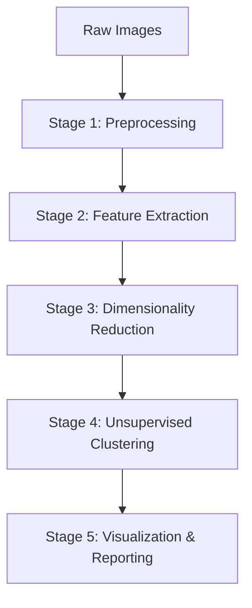
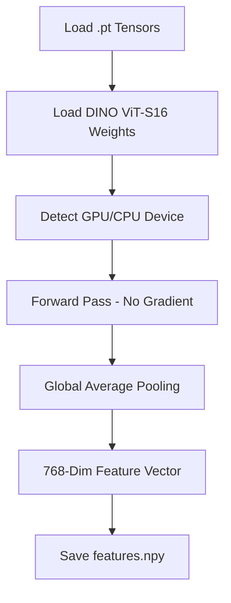
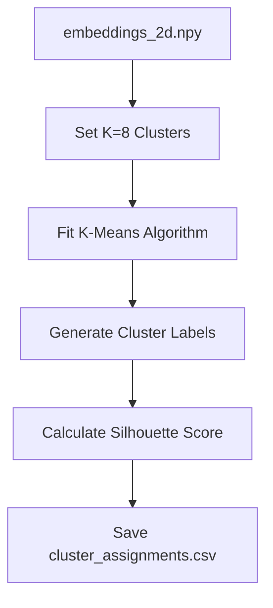
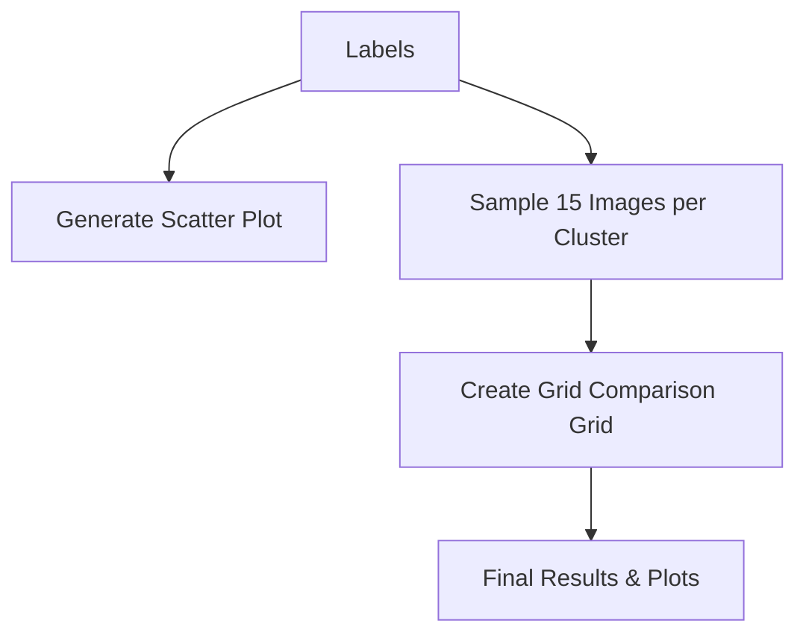

# Project Workflow Diagrams: DINO ViT-S16 Clustering

This document provides visual flowcharts for each stage of the pipeline to help explain the internal processes of the system.

## 1. Overall Pipeline Flow
The high-level view of how data moves through the system.

---

## 2. Stage 1: Preprocessing Details
What happens inside `src/data_loader.py` and `preprocess.py`.

---

## 3. Stage 2: Feature Extraction Details
What happens inside `src/feature_extractor.py`.

---

## 4. Stage 3: Dimensionality Reduction (UMAP)
What happens inside `src/dim_reducer.py`.

---

## 5. Stage 4: Unsupervised Clustering (K-Means)
What happens inside `src/clustering.py`.

---

## 6. Stage 5: Visualization & Comparison
What happens inside the visualization scripts.

