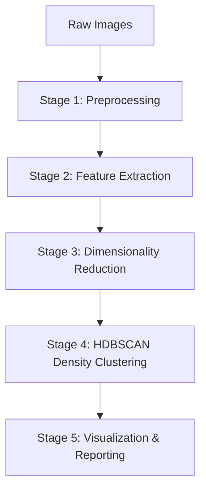
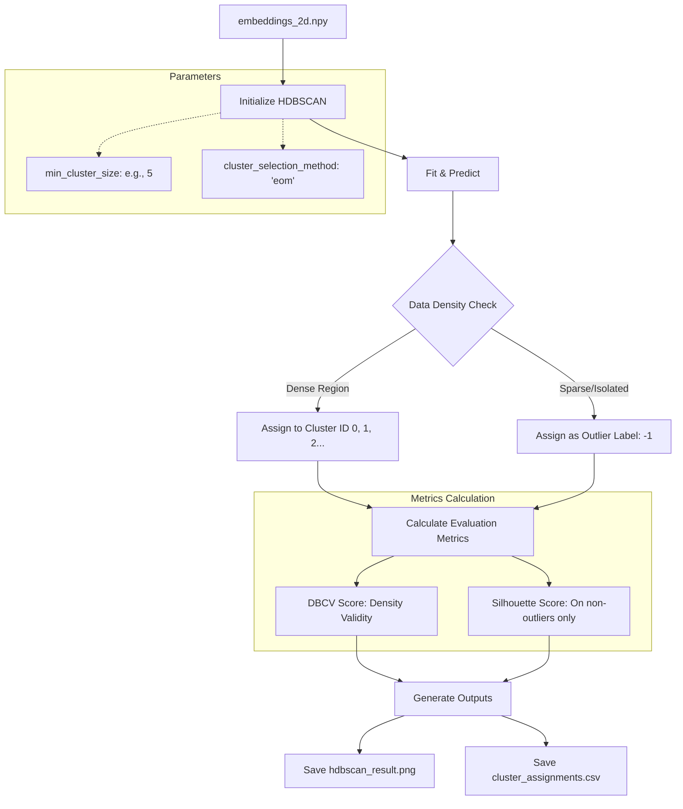
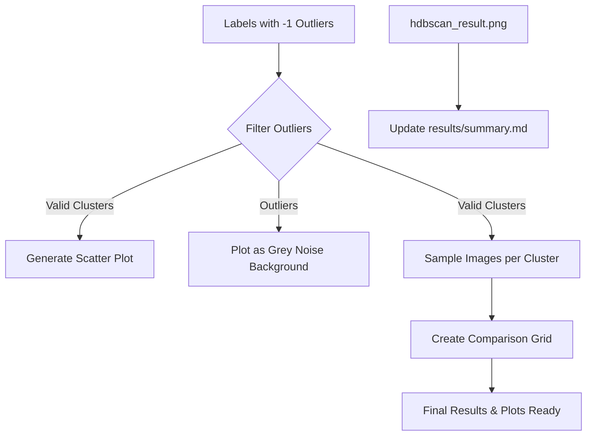

# Project Workflow Diagrams: DINO ViT-S16 HDBSCAN Clustering

This document provides flowcharts reflecting the **Density-Based Automatic Clustering** feature using HDBSCAN.

## 1. Overall Pipeline Flow (HDBSCAN)
The high-level view showing the shift to density-based clustering.

---

## 2. Stage 4: HDBSCAN Clustering Detail
Detailed logic of how HDBSCAN processes the data without requiring a predefined number of clusters.

---

## 3. Visualization & Documentation (Updated)
How the outputs are visualized, specifically handling noise/outliers.

