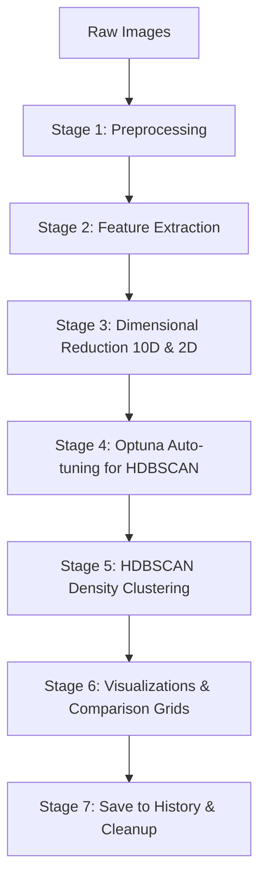
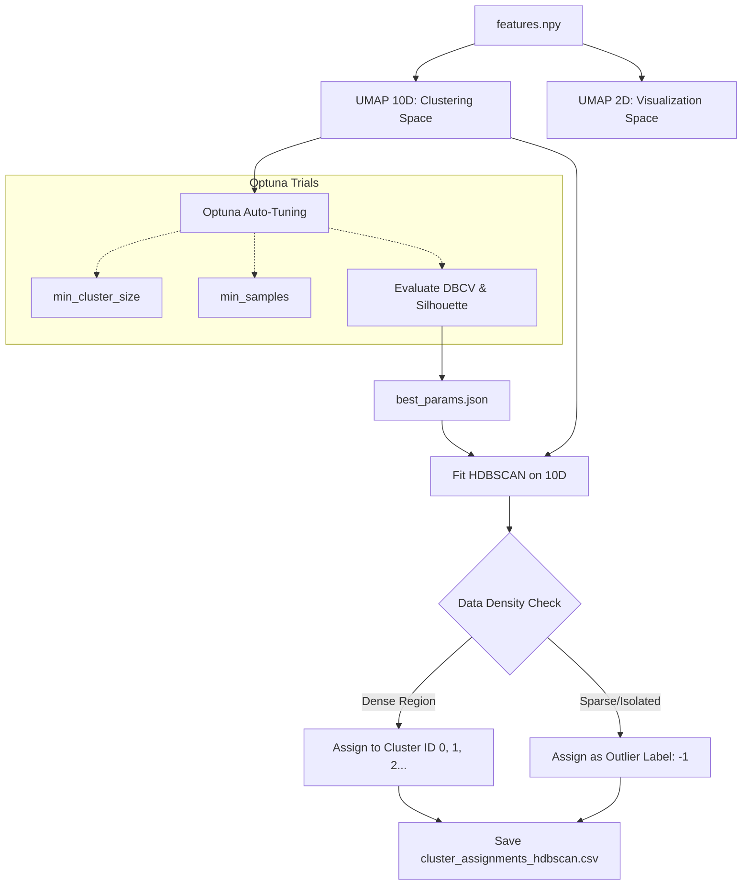
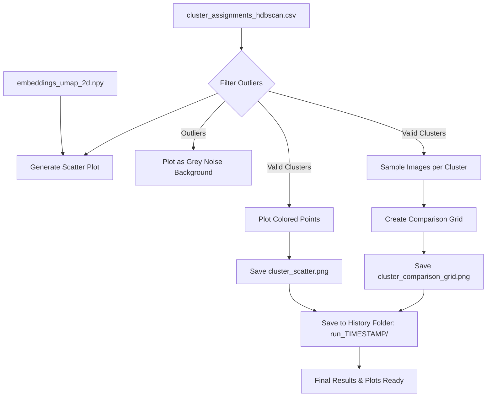

# Project Workflow Diagrams: DINO ViT-S16 HDBSCAN Clustering (Auto-Tuned)

This document provides flowcharts reflecting the current **Density-Based Automatic Clustering** feature using UMAP 10D, Optuna Auto-tuning, and HDBSCAN, based on the latest pipeline execution architecture.

## 1. Overall Pipeline Flow
The high-level view showing all stages from raw images to generating visual comparison grids and saving history.

---

## 2. Stage 3, 4, & 5: Dimensionality Reduction, Tuning & Clustering Detail
Detailed logic of how features are reduced, parameters are tuned, and clustering is applied.

---

## 3. Stage 6 & 7: Visualization, Reporting & History
How the outputs are visualized, dealing with UMAP 2D, generating comparison grids, and archiving.

