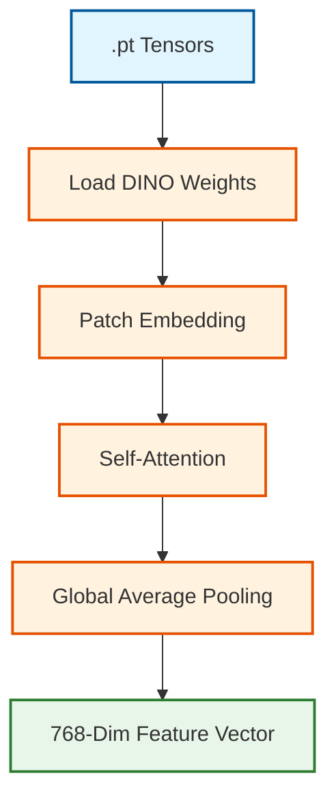
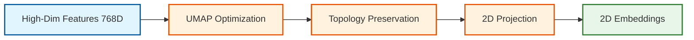
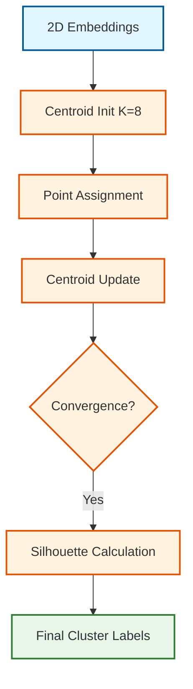

# LAPORAN TEKNIS PENELITIAN: KLASIFIKASI VISUAL PATUNG BALI
## Implementasi Unsupervised Clustering Berbasis DINO ViT-S16

---

## 1. TAHAP PREPROCESSING DATA

Tahap awal dalam penelitian ini difokuskan pada penyiapan data agar sesuai dengan standar arsitektur model Vision Transformer. Dataset yang disediakan pada dasarnya sudah memiliki kualitas yang sangat baik dengan resolusi dasar 256x256 piksel. Untuk memaksimalkan performa ekstraksi fitur pada model DINO ViT-S16, dilakukan serangkaian transformasi spesifik:

-   **Standardize Format**: Memastikan semua gambar memiliki kanal warna RGB yang konsisten dan format file yang seragam untuk menghindari *error* saat pembacaan data secara batch.
-   **Center Crop 224x224**: Memotong bagian tengah gambar dengan presisi untuk membuang informasi latar belakang (*background*) yang tidak relevan dan memfokuskan model pada objek patung sebagai subjek utama.
-   **Tensor Conversion**: Mengubah data piksel mentah (dalam format HWC) menjadi struktur data multidimensi (CHW) atau matriks numerik yang dapat diproses secara efisien oleh kartu grafis (GPU).
-   **Normalization**: Menggeser nilai piksel sehingga memiliki rata-rata 0 dan standar deviasi 1 menggunakan statistik ImageNet. Hal ini krusial agar distribusi data selaras dengan model *pretrained* yang digunakan.


---

## 2. TAHAP EKSTRAKSI FITUR (FEATURE EXTRACTION)

Setelah data siap dalam bentuk tensor, dilakukan ekstraksi fitur mendalam menggunakan model **DINO ViT-S16**. Proses ini melibatkan pemanfaatan model *self-supervised* yang memahami struktur visual tanpa label manual:

-   **Patch Embedding**: Gambar dipecah menjadi potongan kecil (*patches*) berukuran $16 \times 16$ piksel. Setiap potongan ini dianggap sebagai satu unit informasi visual linear.
-   **Self-Attention**: Lapisan inti transformer yang melakukan komputasi untuk melihat hubungan spasial antar bagian patung (misal: keterkaitan detail ukiran kepala dengan proporsi badan).
-   **Global Average Pooling**: Meringkas seluruh informasi dari ribuan *patches* menjadi satu representasi vektor tunggal untuk mewakili satu gambar secara utuh.

Representasi fitur akhir untuk setiap gambar didefinisikan sebagai vektor $\mathbf{x} \in \mathbb{R}^{768}$.



---

## 3. TAHAP REDUKSI DIMENSI (DIMENSIONALITY REDUCTION)

Vektor fitur berdimensi 768 memiliki kompleksitas tinggi yang dapat menghambat akurasi clustering (*Curse of Dimensionality*). Algoritma **UMAP** digunakan dengan tahapan berikut:

-   **UMAP Optimization**: Membangun grafik tetangga terdekat (*k-nearest neighbor graph*) dalam ruang 768D untuk memahami struktur lokal data.
-   **Topology Preservation**: Menjaga agar gambar yang secara visual mirip tetap berada berdekatan secara topologis dalam ruang baru.
-   **2D Coordinate Projection**: Memetakan posisi setiap gambar ke dalam koordinat sederhana $(x, y)$ untuk keperluan clustering dan visualisasi.



---

## 4. TAHAP CLUSTERING (PENGELOMPOKAN)

Koordinat 2D hasil reduksi dimensi diproses menggunakan algoritma **K-Means**. Algoritma ini bertujuan meminimalkan *within-cluster sum-of-squares* (WCSS):

-   **Centroid Initialization**: Menempatkan $K=8$ titik pusat awal secara acak di ruang embedding.
-   **Iterative Assignment**: Setiap gambar ditetapkan ke cluster terdekat berdasarkan jarak Euclidean $d(p, q) = \sqrt{\sum (p_i - q_i)^2}$.

### Distribusi Data per Cluster
Setelah proses konvergensi tercapai, sistem menghasilkan distribusi data yang bervariasi untuk kedelapan cluster. Berikut adalah rincian jumlah gambar pada masing-masing kelompok:

| Cluster ID | Jumlah Gambar | Persentase |
|------------|---------------|------------|
| Cluster 0  | 2.239         | 22.27%     |
| Cluster 1  | 1.051         | 10.46%     |
| Cluster 2  | 481           | 4.78%      |
| Cluster 3  | 1.860         | 18.50%     |
| Cluster 4  | 1.267         | 12.60%     |
| Cluster 5  | 782           | 7.78%      |
| Cluster 6  | 954           | 9.49%      |
| Cluster 7  | 1.418         | 14.11%     |
| **Total**  | **10.052**    | **100%**   |

> **Analisis Distribusi**: Terlihat bahwa Cluster 0 merupakan kelompok terbesar dengan 2.239 gambar, yang mengindikasikan adanya kategori objek yang sangat umum dalam dataset. Sebaliknya, Cluster 2 merupakan kelompok terkecil (481 gambar), yang menunjukkan adanya karakteristik visual yang lebih spesifik atau langka dibandingkan kategori lainnya.

-   **Silhouette Evaluation**: Mengukur kualitas clustering. Metrik Silhouette $s(i)$ untuk sebuah data point $i$ didefinisikan sebagai:

$$s(i) = \frac{b(i) - a(i)}{\max(a(i), b(i))}$$

> Di mana $a(i)$ adalah jarak rata-rata ke sampel lain dalam cluster yang sama, dan $b(i)$ adalah jarak rata-rata ke cluster terdekat berikutnya. Skor rata-rata yang diperoleh adalah **0.5054**.



---

## 5. TAHAP VISUALISASI DAN EVALUASI

Tahap akhir menerjemahkan hasil numerik menjadi bukti visual kualitatif yang dapat divalidasi oleh pakar budaya atau peneliti:

-   **Scatter Plot Generation**: Memetakan 10.052 titik data ke layar berdasarkan label warna untuk melihat separasi antar kelompok secara makro.
-   **Random Sampling**: Mengambil 15 sampel gambar secara acak dari setiap cluster tanpa bias untuk keperluan inspeksi manual.
### Hasil Visualisasi Makro (Scatter Plot)
Scatter plot di bawah ini menunjukkan distribusi 10.052 titik data patung Bali dalam ruang 2D. Pemisahan warna yang jelas mengindikasikan bahwa fitur DINO ViT-S16 berhasil membedakan karakteristik visual antar kelompok.


### Hasil Verifikasi Kualitatif (Grid Comparison)
Untuk memastikan konsistensi visual, grid di bawah ini menampilkan perbandingan sampel antar cluster. Setiap baris menunjukkan representasi objek yang memiliki kemiripan bentuk, pose, atau detail ukiran.


---
*Laporan ini dioptimasi untuk kebutuhan dokumentasi teknis Bab III dan Bab IV Skripsi Informatika.*
tage]:::process
    Grid --> Report[Final Technical Report]:::output
```

---
*Laporan ini dioptimasi untuk kebutuhan dokumentasi teknis Bab III dan Bab IV Skripsi Informatika.*
