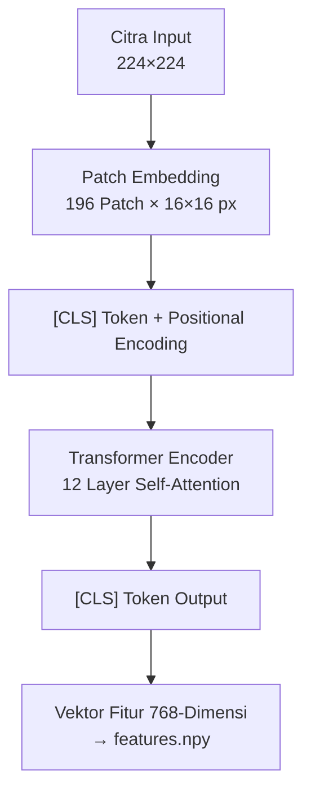
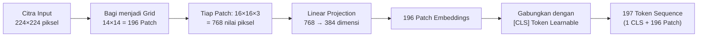
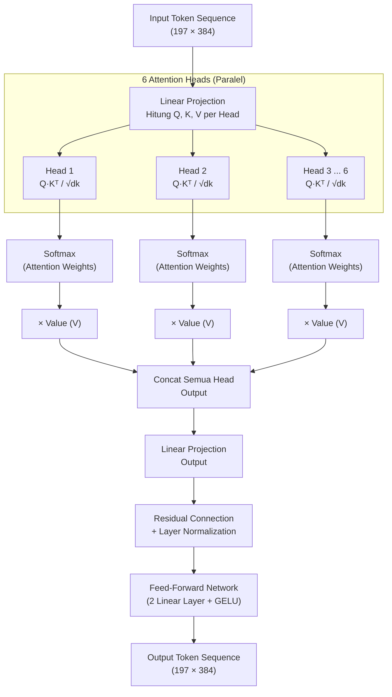
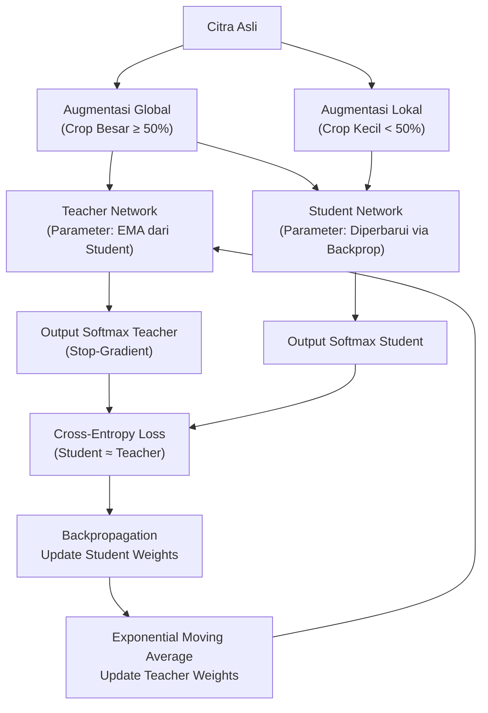
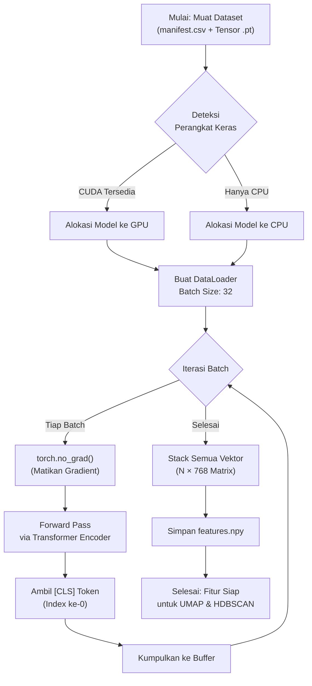

# Flowchart DINO ViT-S16 (Self-Supervised Feature Extractor)

Dokumen ini menyajikan diagram alur kerja internal arsitektur **DINO ViT-S16** sebagai tulang punggung ekstraksi fitur dalam sistem *unsupervised clustering* citra patung.

---

## 1. Alur Utama DINO ViT-S16

Gambaran besar bagaimana satu citra diproses dari piksel mentah menjadi vektor fitur 768-dimensi.

---

## 2. Detail Mekanisme Patch Embedding

Proses pemecahan citra menjadi *patch* sebelum dimasukkan ke dalam *Transformer Encoder*.

---

## 3. Detail Mekanisme Multi-Head Self-Attention

Bagaimana setiap *Transformer Layer* memproses relasi antar token melalui mekanisme *self-attention*.

---

## 4. DINO Self-Supervised Training Objective (Knowledge Distillation)

Bagaimana DINO melatih model tanpa label melalui mekanisme *student–teacher distillation*.

---

## 5. Alur Inference: Ekstraksi Fitur Batch

Alur operasional saat DINO ViT-S16 digunakan untuk mengekstraksi fitur dari seluruh dataset (mode *inference*, tanpa pelatihan).

---

> **Catatan:** Model DINO ViT-S16 yang digunakan adalah *pre-trained* dari Facebook Research dan **tidak** dilatih ulang (*frozen weights*). Seluruh tahap pelatihan DINO (Knowledge Distillation) dijelaskan di Diagram 4 sebagai konteks teoritis arsitektur, bukan sebagai bagian dari pipeline eksperimen.
