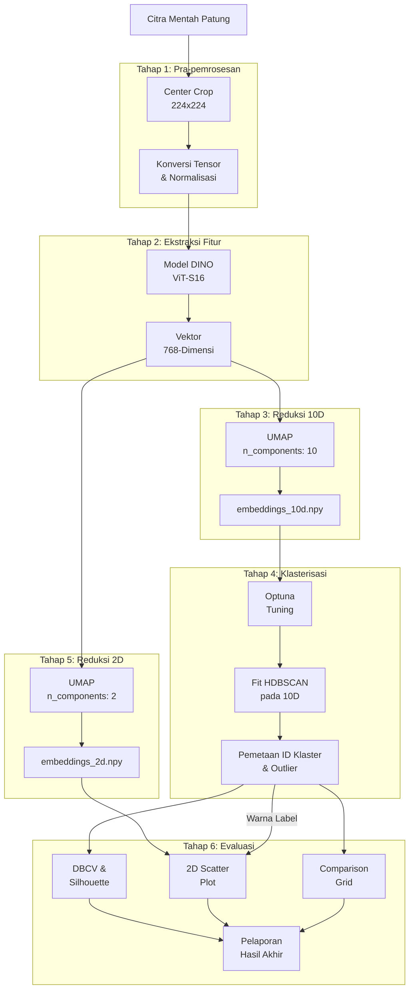
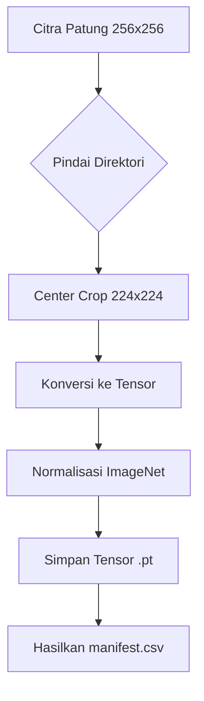
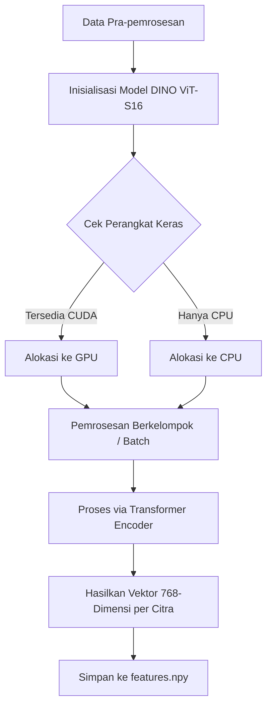
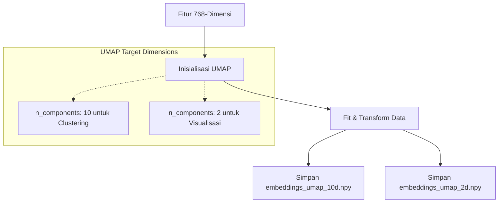
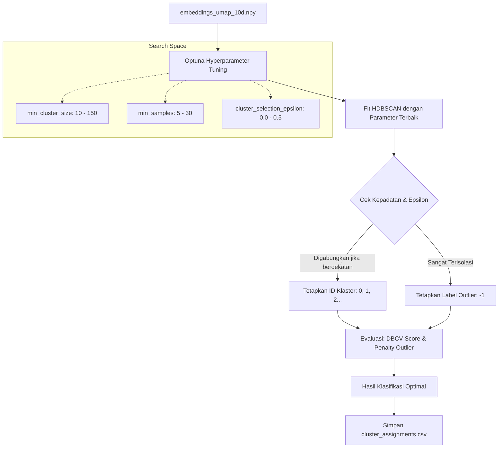
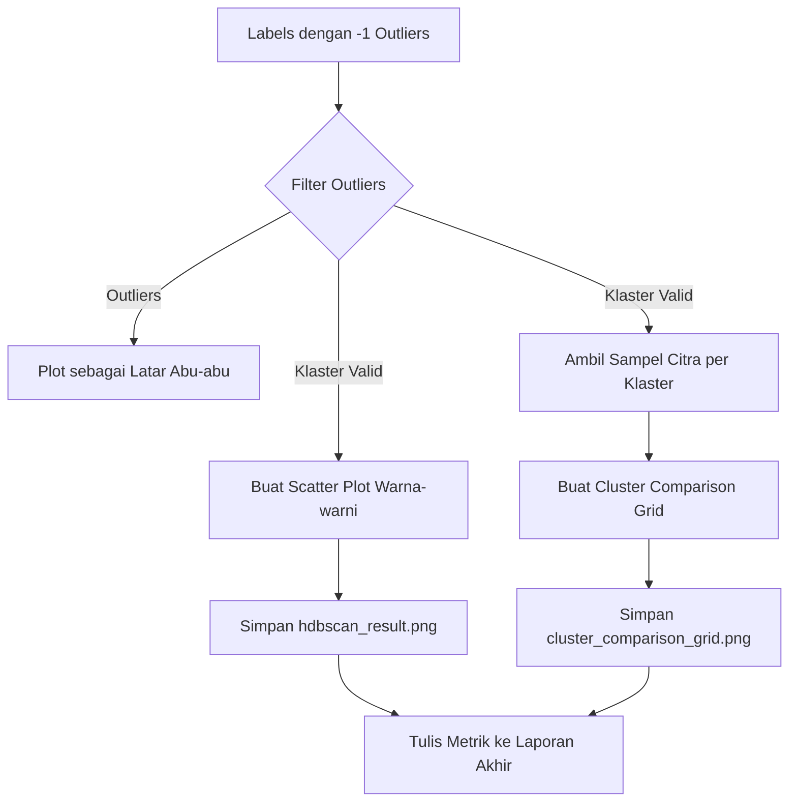

# Penjelasan Diagram Alur (Flowchart) Sistem Clustering

Berikut adalah narasi ilmiah formal yang menjelaskan keseluruhan diagram alur sistem *unsupervised clustering* menggunakan DINO ViT-S16 dan HDBSCAN secara mendetail, yang disusun untuk keperluan penulisan Bab III Skripsi. Anda dapat menyesuaikan penomoran Gambar (misal: Gambar 3.1) sesuai dengan format draf Anda.

---

### 1. Alur Keseluruhan Sistem (Overall Pipeline)

Gambar 3.1 mengilustrasikan arsitektur sistem yang diusulkan, yang beroperasi melalui enam tahapan pemrosesan data yang berurutan. Tahap awal melibatkan pra-pemrosesan (*preprocessing*) citra mentah untuk menstandarisasi dimensi dan menormalisasi nilai piksel citra. Selanjutnya, citra dimasukkan ke dalam tahap ekstraksi fitur menggunakan arsitektur DINO ViT-S16, menghasilkan vektor berdimensi tinggi (768D). Mengingat kompleksitas komputasional, fitur tersebut direduksi ke dalam ruang 10 dimensi (10D) menggunakan algoritma *Uniform Manifold Approximation and Projection* (UMAP) agar struktur relasi data tetap terjaga optimal untuk clustering. Selanjutnya, algoritma HDBSCAN yang parameternya telah dioptimasi secara otomatis menggunakan Optuna melakukan pengelompokan berbasis kepadatan. Untuk keperluan visualisasi bagi manusia, dimensi 10D direduksi lagi menjadi 2 dimensi (2D). Tahap akhir dari sistem ini adalah evaluasi kuantitatif dan pelaporan grafis.

---

### 2. Detail Tahap 1: Pra-pemrosesan Data (Preprocessing Detail)

Gambar 3.2 merincikan tahapan pra-pemrosesan yang bertujuan untuk menstandarkan masukan sebelum diproses oleh model *deep learning*. Proses dimulai dengan memindai direktori citra mentah yang sebelumnya telah diseragamkan ke ukuran 256x256 piksel. Tahap krusial pertama adalah melakukan pemotongan bagian tengah citra (*Center Crop*) menjadi resolusi 224x224 piksel untuk mempertahankan fokus objek utama sekaligus memenuhi syarat dimensi spasial model *Vision Transformer*. Selanjutnya, citra dikonversi menjadi format matriks (*PyTorch Tensor*) dan nilai intensitas pikselnya dinormalisasi menggunakan standar distribusi warna *ImageNet* (*Z-score normalization*), sehingga mempercepat konvergensi dan menjaga stabilitas ekstraksi fitur. Berkas tensor yang telah terstandarisasi ini selanjutnya disimpan (.pt) secara terstruktur bersama dengan berkas manifest (`manifest.csv`) yang mendokumentasikan pemetaan *dataset*.

---

### 3. Detail Tahap 2: Ekstraksi Fitur (Feature Extraction Detail)

Gambar 3.3 membedah mekanisme kerja dari modul ekstraksi fitur menggunakan *pre-trained model* DINO ViT-S16. Tahap ini diawali dengan inisialisasi parameter model dan pendeteksian otomatis terhadap unit pemrosesan perangkat keras (GPU dengan arsitektur CUDA atau CPU standar) untuk mendistribusikan beban komputasi. Citra yang telah melalui pra-pemrosesan dimasukkan secara berkelompok (*batch processing*) ke dalam lapisan *Transformer Encoder*. Melalui mekanisme *self-attention* internal model, informasi spasial dan semantik dari citra diagregasi menjadi sebuah token kelas (*[CLS] token*) akhir. Output dari proses ini adalah representasi matematis dari masing-masing citra berupa vektor berdimensi 768. Kumpulan vektor ini kemudian digabungkan ke dalam sebuah matriks (N x 768) dan diekspor menjadi berkas *numpy array* (`features.npy`).

---

### 4. Detail Tahap 3 & 5: Reduksi Dimensi 10D dan 2D (Dimensionality Reduction Detail)

Gambar 3.4 mendemonstrasikan tahapan reduksi dimensi spasial dengan pendekatan dua langkah (*two-step approach*). Pertama, vektor 768-dimensi dimasukkan ke dalam algoritma *Uniform Manifold Approximation and Projection* (UMAP) dengan target ruang 10 komponen (`n_components: 10`). Dimensi 10D ini sangat krusial karena mampu meminimalkan dampak "kutukan dimensi" (*curse of dimensionality*) sekaligus tetap mempertahankan relasi kepadatan fitur untuk dibaca oleh algoritma mesin (HDBSCAN). Kedua, sistem juga membuat model reduksi sekunder ke ruang 2 dimensi (`n_components: 2`) yang ditujukan *murni* untuk keperluan pemetaan visual pada kanvas layar bagi manusia. Hasil dari tahap ini adalah dua matriks: koordinat 10D untuk *clustering* (`embeddings_umap_10d.npy`) dan koordinat 2D untuk visualisasi (`embeddings_umap_2d.npy`).

---

### 5. Detail Tahap 4: Klasterisasi HDBSCAN & Optuna (Auto-Tuned HDBSCAN Detail)

Gambar 3.5 menunjukkan proses klasterisasi yang telah ditingkatkan menggunakan mesin optimasi *Hyperparameter* Optuna. Proses dimulai dengan menerima matriks 10 dimensi (`embeddings_umap_10d.npy`). Alih-alih menebak parameter, Optuna secara otomatis melakukan iterasi (contoh: 30 *trials*) untuk mencari kombinasi terbaik dari `min_cluster_size`, `min_samples`, dan `cluster_selection_epsilon`. Optuna dirancang untuk memaksimalkan skor *Density-Based Cluster Validity* (DBCV) sekaligus memberikan penalti jika jumlah *outlier* terlalu tinggi (misal > 40%). Melalui mekanisme *cluster_selection_epsilon*, kelompok-kelompok kecil yang jaraknya saling berdekatan digabungkan (dijahit) menjadi klaster utama yang lebih besar dan rasional. Data di area padat menjadi inti klaster (0, 1, 2, dst.), sementara yang sangat terisolasi dilabeli -1 (Outlier). Hasil pemetaan klaster yang optimal diekspor ke dalam format tabular (`cluster_assignments.csv`).

---

### 6. Detail Tahap 6: Evaluasi dan Visualisasi (Evaluation & Visualization)

Gambar 3.6 memaparkan tahap 6 (tahap akhir) dari *pipeline*, yang berfokus pada interpretasi visual terhadap luaran algoritma sistem. Berdasarkan array label yang mencakup indeks klaster dan indikator anomali (-1), sistem melakukan penyaringan terstruktur untuk memisahkan data *outlier* dari anggota klaster yang valid. Data yang tergolong dalam klaster valid akan dipetakan ke dalam bentuk grafik sebaran (*scatter plot*) dengan palet warna diskrit untuk merepresentasikan batasan kelompok. Selain itu, sampel citra dari tiap klaster divisualisasikan dalam bentuk *comparison grid* yang menampilkan komparasi visual aktual antar kelompok. Di sisi lain, titik data yang diklasifikasikan sebagai *outlier* divisualisasikan dalam latar *scatter plot* menggunakan warna abu-abu netral (*grey noise*), guna memberikan konteks mengenai sebaran anomali. Keseluruhan metrik evaluasi beserta parameter operasional diagregasi dan didokumentasikan secara komprehensif ke dalam laporan metrik akhir sebagai instrumen empiris pelaporan penelitian.

