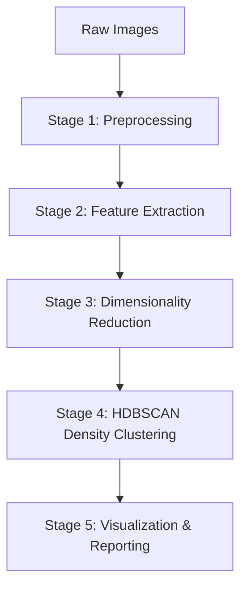
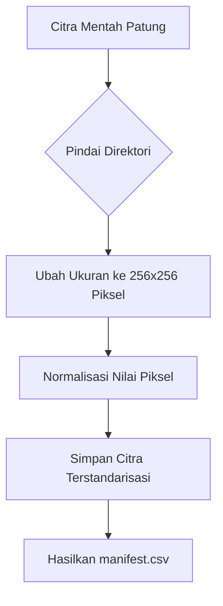
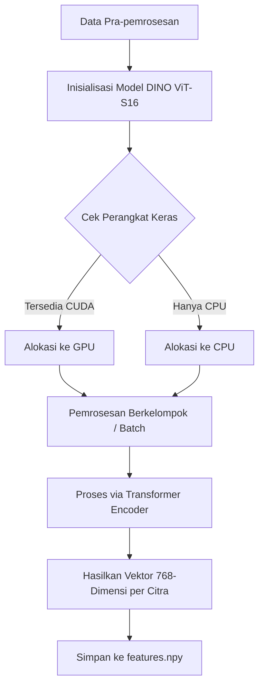
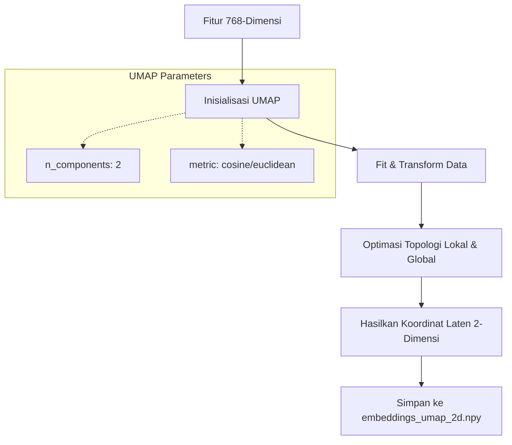
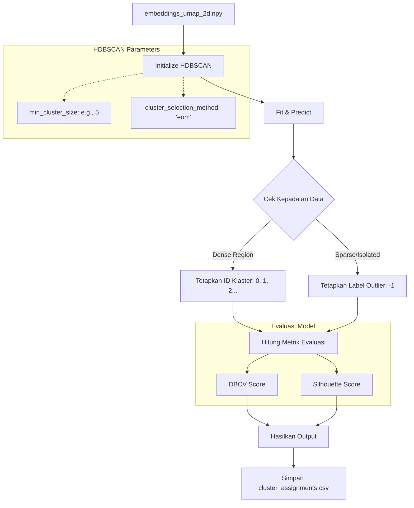
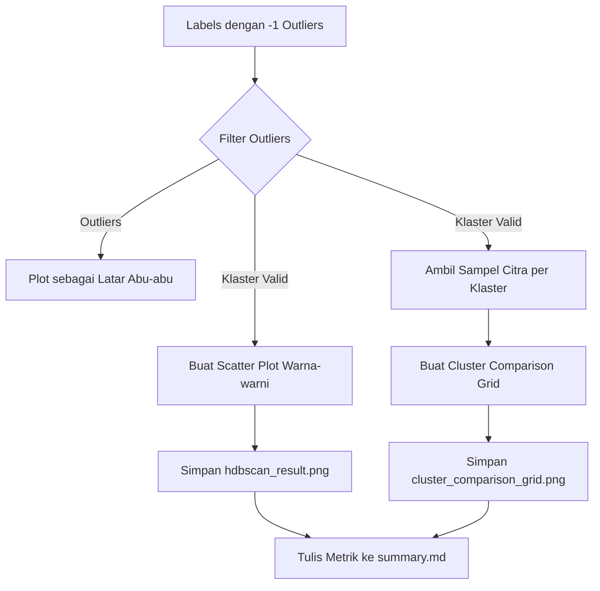

# Penjelasan Diagram Alur (Flowchart) Sistem Clustering

Berikut adalah narasi ilmiah formal yang menjelaskan keseluruhan diagram alur sistem *unsupervised clustering* menggunakan DINO ViT-S16 dan HDBSCAN secara mendetail, yang disusun untuk keperluan penulisan Bab III Skripsi. Anda dapat menyesuaikan penomoran Gambar (misal: Gambar 3.1) sesuai dengan format draf Anda.

---

### 1. Alur Keseluruhan Sistem (Overall Pipeline)

Gambar 3.1 mengilustrasikan arsitektur sistem yang diusulkan, yang beroperasi melalui lima tahapan pemrosesan data yang berurutan. Tahap awal melibatkan pra-pemrosesan (*preprocessing*) citra mentah untuk menstandarisasi dimensi dan menormalisasi nilai piksel citra. Selanjutnya, citra yang telah diproses dimasukkan ke dalam tahap ekstraksi fitur menggunakan arsitektur DINO ViT-S16, yang mentransformasikan representasi visual ke dalam ruang fitur berdimensi tinggi. Mengingat kompleksitas komputasional pada ruang dimensi tinggi, fitur tersebut kemudian direduksi ke dalam ruang dua dimensi menggunakan algoritma *Uniform Manifold Approximation and Projection* (UMAP). Titik-titik data hasil proyeksi tersebut kemudian menjadi masukan bagi algoritma HDBSCAN untuk melakukan pengelompokan berbasis kepadatan (*density-based clustering*). Tahap akhir dari sistem ini adalah visualisasi dan pelaporan, di mana hasil dari proses *clustering* dievaluasi secara kuantitatif dan disajikan secara grafis untuk memfasilitasi analisis lebih lanjut.

---

### 2. Detail Tahap 1: Pra-pemrosesan Data (Preprocessing Detail)

Gambar 3.2 merincikan tahapan pra-pemrosesan yang bertujuan untuk menstandarkan masukan sebelum diproses oleh model *deep learning*. Proses dimulai dengan memindai seluruh direktori yang berisi citra mentah patung. Setiap citra yang terbaca kemudian diubah ukurannya (*resize*) secara seragam menjadi resolusi 256x256 piksel untuk memenuhi syarat dimensi spasial model arsitektur *Vision Transformer*. Setelah penyesuaian resolusi spasial, sistem melakukan normalisasi nilai intensitas piksel untuk mentransformasikan rentang warna ke skala standar, sehingga mempercepat konvergensi dan menjaga stabilitas ekstraksi fitur. Berkas citra yang telah terstandarisasi ini selanjutnya disimpan secara terstruktur bersama dengan berkas manifest (`manifest.csv`) yang mendokumentasikan pemetaan *dataset*.

---

### 3. Detail Tahap 2: Ekstraksi Fitur (Feature Extraction Detail)

Gambar 3.3 membedah mekanisme kerja dari modul ekstraksi fitur menggunakan *pre-trained model* DINO ViT-S16. Tahap ini diawali dengan inisialisasi parameter model dan pendeteksian otomatis terhadap unit pemrosesan perangkat keras (GPU dengan arsitektur CUDA atau CPU standar) untuk mendistribusikan beban komputasi. Citra yang telah melalui pra-pemrosesan dimasukkan secara berkelompok (*batch processing*) ke dalam lapisan *Transformer Encoder*. Melalui mekanisme *self-attention* internal model, informasi spasial dan semantik dari citra diagregasi menjadi sebuah token kelas (*[CLS] token*) akhir. Output dari proses ini adalah representasi matematis dari masing-masing citra berupa vektor berdimensi 768. Kumpulan vektor ini kemudian digabungkan ke dalam sebuah matriks (N x 768) dan diekspor menjadi berkas *numpy array* (`features.npy`).

---

### 4. Detail Tahap 3: Reduksi Dimensi (Dimensionality Reduction Detail)

Gambar 3.4 mendemonstrasikan tahapan reduksi dimensi spasial, yang berfungsi untuk meminimalkan dampak "kutukan dimensi" (*curse of dimensionality*) serta mempersiapkan data untuk pengelompokan spasial. Vektor 768-dimensi dimasukkan ke dalam algoritma *Uniform Manifold Approximation and Projection* (UMAP). Sistem menetapkan parameter ruang target sebesar dua komponen (`n_components: 2`) untuk proyeksi visual 2D. Algoritma kemudian mengeksekusi metode *fit and transform*, di mana ia menyusun graf topologi lokal pada ruang dimensi tinggi dan mengoptimalkan tata letaknya (layout) pada ruang proyeksi berdimensi rendah, dengan mempertahankan struktur kedekatan titik data. Luaran dari proses ini adalah titik koordinat dua dimensi yang kemudian disimpan sebagai matriks baru (`embeddings_umap_2d.npy`).

---

### 5. Detail Tahap 4: Klasterisasi HDBSCAN (HDBSCAN Clustering Detail)

Gambar 3.5 menunjukkan proses klasterisasi secara mendetail, yang dimulai dengan menerima matriks representasi dua dimensi (`embeddings_umap_2d.npy`) sebagai masukan untuk menginisialisasi objek HDBSCAN. Inisialisasi ini mengonfigurasi parameter utama, yaitu `min_cluster_size`, untuk mendefinisikan batas minimal anggota suatu klaster. Selain itu, sistem menetapkan metode pemilihan klaster menggunakan *Excess of Mass* (`eom`) guna mengoptimalkan stabilitas klaster yang terbentuk. Setelah proses *fit* dan *predict* dieksekusi, algoritma melakukan evaluasi kepadatan distribusi data. Area dengan kepadatan tinggi (*dense region*) akan diidentifikasi sebagai inti klaster dan diberikan label identifikasi klaster, sedangkan data yang berada pada area renggang atau terisolasi (*sparse/isolated*) akan diklasifikasikan sebagai *noise* dan diberikan label *outlier* (-1). Kinerja dari partisi data ini kemudian dievaluasi secara matematis menggunakan *Density-Based Cluster Validity* (DBCV) untuk menilai kualitas kepadatan klaster, serta *Silhouette Score* yang dihitung secara eksklusif pada data non-*outlier*. Hasil pemetaan ini diekspor ke dalam format tabular (`cluster_assignments.csv`).

---

### 6. Detail Tahap 5: Visualisasi dan Dokumentasi (Visualization & Reporting)

Gambar 3.6 memaparkan tahap akhir dari *pipeline*, yang berfokus pada interpretasi visual terhadap luaran algoritma sistem. Berdasarkan array label yang mencakup indeks klaster dan indikator anomali (-1), sistem melakukan penyaringan terstruktur untuk memisahkan data *outlier* dari anggota klaster yang valid. Data yang tergolong dalam klaster valid akan dipetakan ke dalam bentuk grafik sebaran (*scatter plot*) dengan palet warna diskrit untuk merepresentasikan batasan kelompok. Selain itu, sampel citra dari tiap klaster divisualisasikan dalam bentuk *comparison grid* yang menampilkan komparasi visual aktual antar kelompok. Di sisi lain, titik data yang diklasifikasikan sebagai *outlier* divisualisasikan dalam latar *scatter plot* menggunakan warna abu-abu netral (*grey noise*), guna memberikan konteks mengenai sebaran anomali. Keseluruhan metrik evaluasi beserta parameter operasional diagregasi dan didokumentasikan secara komprehensif ke dalam berkas `results/summary.md` sebagai instrumen empiris pelaporan penelitian.

